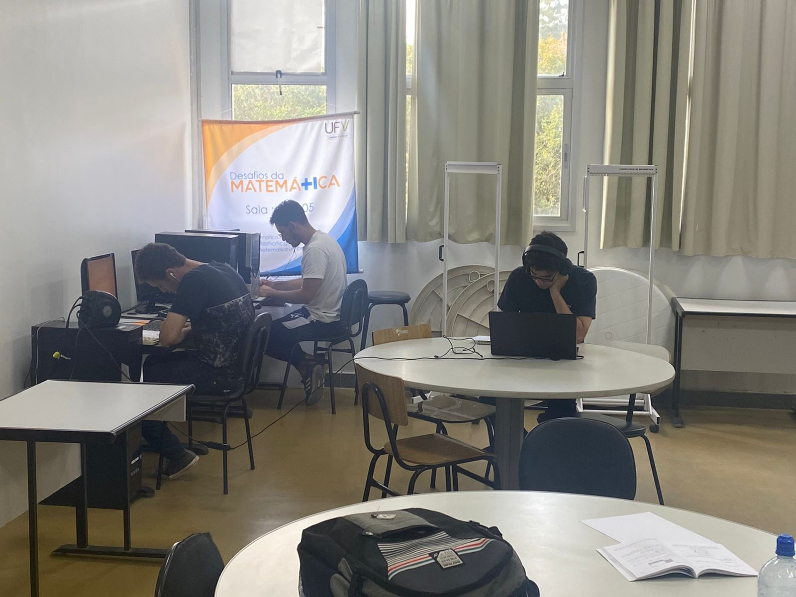
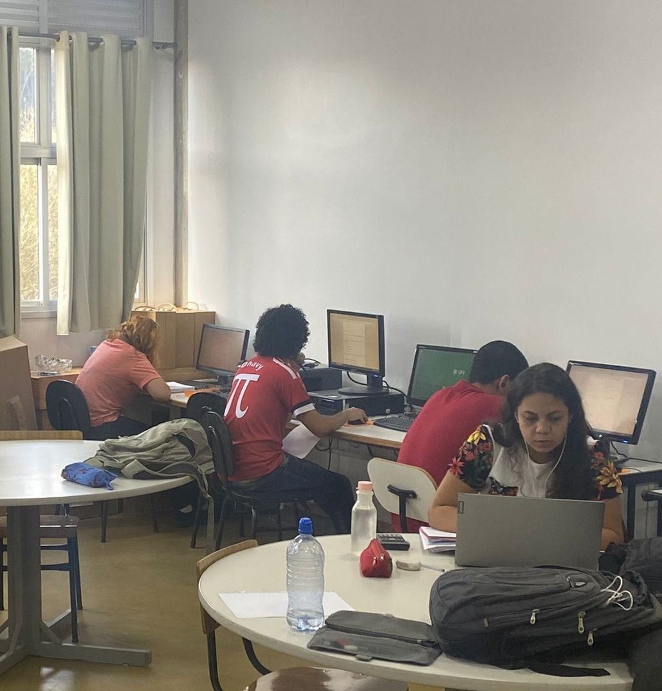
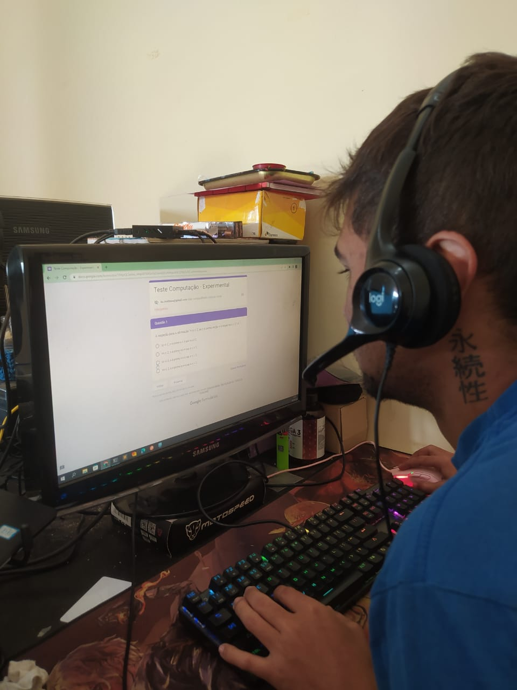

```{r, include=FALSE, echo=FALSE}
library(knitr)
library(emo)
library(xaringan)
library(xaringanExtra)
```

```{r xaringan-panelset, echo=FALSE}
xaringanExtra::use_panelset()
```

```{r, include=FALSE, echo=FALSE}
source("./funcoes.R")
source("./leituraBase.R")
knitr::opts_chunk$set(echo = FALSE, warning = FALSE, message = FALSE)
```

class: center, middle

```{r qrcode, echo=FALSE, out.width='30%'}
# knitr::include_graphics('img/Sia2022.png')
```
</div>
.center[
[guilhermefco.github.io/TrabalhoExperimental](guilhermefco.github.io/TrabalhoExperimental)
]

.center[
[guilhermefco.github.io/TrabalhoExperimental/Relatorio](guilhermefco.github.io/TrabalhoExperimental/Relatorio)
]

---
# Sumário

- Introdução
- Materiais e Métodos
- Análise Geral
- Análise separada por curso
- Conclusão

---
# Introdução

- Presencial
    - Aulas Presenciais
    - Provas físicas e presenciais
    
- Remoto
    - Aulas gravadas ou síncronas
    - Provas online e remotas
        - Conhecimento da plataforma
        - Conexão Estável

- Devido a pandemia do Covid-19, fomos forçados a ter aulas remotas

- No semestre atual (2022/1) a UFV definiu que as aulas obrigatoriamente deveriam ser presenciais
      - Alguns alunos e professores preferiam o ensino remoto
      - Qual deles é o melhor?

---
class: center, middle, inverse

# Objetivo

Será que realmente há diferença de aprendizagem entre o presencial e o remoto?

---
# Materiais e Métodos

- Google Forms
- Laboratório de Informática da Matemática
- Excel
- R
- Github
- ANOVA

---
# Provas

- 20 questões
- Dados anônimos
- Disciplinas
- Google Forms

---

# Tratamento

- Música

---
# Laboratório de Informática da Matemática

- Ambiente controlado

```{r, fig.align='center', out.width='70%', out.height='70%'}

```

---
# Laboratório de Informática da Matemática

- Ambiente controlado

```{r, fig.align='center', out.width='60%', out.height='50%'}

```

---
# Laboratório de Informática da Matemática

- Ambiente controlado

```{r, fig.align='center', out.width='60%', out.height='50%'}

```

---
# Delineamento

- DBC
  - Curso
  - Formato do Ensino
  
---
# Análise Geral

## Por Formato de Ensino

.center[
```{r, echo=FALSE, out.width="70%"}
descritivaContinua(
  df = base, 
  variaveis = c("numero_acertos", "idade", "duracao"),
  grupo = "formato_ensino"
) %>% kableExtra::kbl(align = 'llc') %>% kableExtra::kable_paper(full_width = F)
```
]

---
# Análise Geral

## Por Formato de Ensino

.center[
```{r, echo=FALSE, out.height="400px"}
boxplot(
  df = base,
  Y = "numero_acertos",
  X = "formato_ensino",
  Title = "Número de Acertos por Formato de Ensino",
  labelX = "Número de Acertos",
  labelY = "Formato de Ensino"
)
```
]

---
# Análise Geral

## Por Formato de Ensino

### Hipótese


$$H_0: \mu_{\text{presencial}} = \mu_{\text{remoto}}$$


---
# Análise Geral

## Por Formato de Ensino

```{r, echo=FALSE}
Anova(base, "numero_acertos ~ formato_ensino", c("Formato do Ensino"))[[2]] %>%
  kableExtra::kbl(align = 'llc') %>% kableExtra::kable_paper()
```

---
# Análise Geral

## Por Tratamento

```{r, echo=FALSE, out.width="70%"}
descritivaContinua(
  df = base,
  variaveis = c("numero_acertos", "idade", "duracao"),
  grupo = "tratamento"
) %>% kableExtra::kbl(align = 'llc') %>% kableExtra::kable_paper(full_width = F)
```

---
# Análise Geral

## Por Tratamento

.center[
```{r, echo=FALSE, out.height="400px"}
boxplot(
  df = base,
  Y = "numero_acertos",
  X = "tratamento",
  Title = "Número de Acertos por Tratamento",
  labelX = "Número de Acertos",
  labelY = "Tratamento"
)
```
]

---
# Análise Geral

## Por Tratamento

### Hipótese


$$H_0: \mu_{\text{Com música}} = \mu_{\text{Sem música}}$$

---
# Análise Geral

## Por Tratamento

```{r, echo=FALSE}
Anova(base, "numero_acertos ~ tratamento", c("Tratamento"))[[2]] %>% 
  kableExtra::kbl(align = 'llc') %>% kableExtra::kable_paper()
```

---
# Análise Geral

## Por Formato de Ensino e Tratamento

```{r, echo=FALSE, out.width="70%"}
descritivaContinua(
  df = base,
  variaveis = c("numero_acertos", "idade", "duracao"),
  grupo = c("formato_ensino", "tratamento")
)[,-(5:6)] %>% kableExtra::kbl(align = 'llc') %>% kableExtra::kable_paper(full_width = F)
```

---
# Análise Geral

## Por Formato de Ensino e Tratamento

.center[
```{r, echo=FALSE, out.height="400px"}
boxplot(
  df = base,
  Y = "numero_acertos",
  X = "formato_ensino",
  grupo = "tratamento",
  Title = "Número de Acertos por Formato de Ensino",
  labelX = "Número de Acertos",
  labelY = "Formato de Ensino",
  legend = "Tratamento"
)
```
]

---
# Análise Geral

## Por Tratamento

### Hipótese


$$H_0: \mu_{\text{Com música:Presencial}} = \mu_{\text{Com música:Remoto}} = \\ \mu_{\text{Sem música:Presencial}} = \mu_{\text{Sem música:Remoto}}$$

---
# Análise Geral

## Por Formato de Ensino e Tratamento

```{r, echo=FALSE}
Anova(base, "numero_acertos ~ formato_ensino * tratamento", c("Formato do Ensino", "Tratamento", "Formato do Ensino : Tratamento"))[[2]] %>% 
  kableExtra::kbl(align = 'llc') %>% kableExtra::kable_paper()
```

---
# Análise Geral

## Por Formato de Ensino e Tratamento

```{r, echo=FALSE}
TukeyHSD(Anova(base, "numero_acertos ~ formato_ensino * tratamento", c("Formato do Ensino", "Tratamento", "Formato do Ensino : Tratamento"))[[1]])$`tratamento`
```


<!-- CDC -->

---
# Análise Ciência da Computação

## Por Formato de Ensino

.center[
```{r, echo=FALSE, out.width="70%"}
descritivaContinua(
  df = baseCDC, 
  variaveis = c("numero_acertos", "idade", "duracao"),
  grupo = "formato_ensino"
) %>% kableExtra::kbl(align = 'llc') %>% kableExtra::kable_paper(full_width = F)
```
]

---
# Análise Ciência da Computação

## Por Formato de Ensino

.center[
```{r, echo=FALSE, out.height="400px"}
boxplot(
  df = baseCDC,
  Y = "numero_acertos",
  X = "formato_ensino",
  Title = "Número de Acertos por Formato de Ensino",
  labelX = "Número de Acertos",
  labelY = "Formato de Ensino"
)
```
]

---
# Análise Ciência da Computação

## Por Formato de Ensino

### Hipótese


$$H_0: \mu_{\text{presencial}} = \mu_{\text{remoto}}$$


---
# Análise Ciência da Computação

## Por Formato de Ensino

```{r, echo=FALSE}
Anova(baseCDC, "numero_acertos ~ formato_ensino", c("Formato do Ensino"))[[2]] %>%
  kableExtra::kbl(align = 'llc') %>% kableExtra::kable_paper()
```

---
# Análise Ciência da Computação

## Por Tratamento

```{r, echo=FALSE, out.width="70%"}
descritivaContinua(
  df = baseCDC,
  variaveis = c("numero_acertos", "idade", "duracao"),
  grupo = "tratamento"
) %>% kableExtra::kbl(align = 'llc') %>% kableExtra::kable_paper(full_width = F)
```

---
# Análise Ciência da Computação

## Por Tratamento

.center[
```{r, echo=FALSE, out.height="400px"}
boxplot(
  df = baseCDC,
  Y = "numero_acertos",
  X = "tratamento",
  Title = "Número de Acertos por Tratamento",
  labelX = "Número de Acertos",
  labelY = "Tratamento"
)
```
]

---
# Análise Ciência da Computação

## Por Tratamento

### Hipótese


$$H_0: \mu_{\text{Com música}} = \mu_{\text{Sem música}}$$

---
# Análise Ciência da Computação

## Por Tratamento

```{r, echo=FALSE}
Anova(baseCDC, "numero_acertos ~ tratamento", c("Tratamento"))[[2]] %>% 
  kableExtra::kbl(align = 'llc') %>% kableExtra::kable_paper()
```

---
# Análise Ciência da Computação

## Por Formato de Ensino e Tratamento

```{r, echo=FALSE, out.width="70%"}
descritivaContinua(
  df = baseCDC,
  variaveis = c("numero_acertos", "idade", "duracao"),
  grupo = c("formato_ensino", "tratamento")
)[,-(5:6)] %>% kableExtra::kbl(align = 'llc') %>% kableExtra::kable_paper(full_width = F)
```

---
# Análise Ciência da Computação

## Por Formato de Ensino e Tratamento

.center[
```{r, echo=FALSE, out.height="400px"}
boxplot(
  df = baseCDC,
  Y = "numero_acertos",
  X = "formato_ensino",
  grupo = "tratamento",
  Title = "Número de Acertos por Formato de Ensino",
  labelX = "Número de Acertos",
  labelY = "Formato de Ensino",
  legend = "Tratamento"
)
```
]

---
# Análise Ciência da Computação

## Por Tratamento

### Hipótese


$$H_0: \mu_{\text{Com música:Presencial}} = \mu_{\text{Com música:Remoto}} = \\ \mu_{\text{Sem música:Presencial}} = \mu_{\text{Sem música:Remoto}}$$

---
# Análise Ciência da Computação

## Por Formato de Ensino e Tratamento

```{r, echo=FALSE}
Anova(baseCDC, "numero_acertos ~ formato_ensino * tratamento", c("Formato do Ensino", "Tratamento", "Formato do Ensino : Tratamento"))[[2]] %>% 
  kableExtra::kbl(align = 'llc') %>% kableExtra::kable_paper()
```


<!-- Matematica -->

---
# Análise Matemática

## Por Formato de Ensino

.center[
```{r, echo=FALSE, out.width="70%"}
descritivaContinua(
  df = baseMAT, 
  variaveis = c("numero_acertos", "idade", "duracao"),
  grupo = "formato_ensino"
) %>% kableExtra::kbl(align = 'llc') %>% kableExtra::kable_paper(full_width = F)
```
]

---
# Análise Matemática

## Por Formato de Ensino

.center[
```{r, echo=FALSE, out.height="400px"}
boxplot(
  df = baseMAT,
  Y = "numero_acertos",
  X = "formato_ensino",
  Title = "Número de Acertos por Formato de Ensino",
  labelX = "Número de Acertos",
  labelY = "Formato de Ensino"
)
```
]

---
# Análise Matemática

## Por Formato de Ensino

### Hipótese


$$H_0: \mu_{\text{presencial}} = \mu_{\text{remoto}}$$


---
# Análise Matemática

## Por Formato de Ensino

```{r, echo=FALSE}
Anova(baseMAT, "numero_acertos ~ formato_ensino", c("Formato do Ensino"))[[2]] %>%
  kableExtra::kbl(align = 'llc') %>% kableExtra::kable_paper()
```

---
# Análise Matemática

## Por Tratamento

```{r, echo=FALSE, out.width="70%"}
descritivaContinua(
  df = baseMAT,
  variaveis = c("numero_acertos", "idade", "duracao"),
  grupo = "tratamento"
) %>% kableExtra::kbl(align = 'llc') %>% kableExtra::kable_paper(full_width = F)
```

---
# Análise Matemática

## Por Tratamento

.center[
```{r, echo=FALSE, out.height="400px"}
boxplot(
  df = baseMAT,
  Y = "numero_acertos",
  X = "tratamento",
  Title = "Número de Acertos por Tratamento",
  labelX = "Número de Acertos",
  labelY = "Tratamento"
)
```
]

---
# Análise Matemática

## Por Tratamento

### Hipótese


$$H_0: \mu_{\text{Com música}} = \mu_{\text{Sem música}}$$

---
# Análise Matemática

## Por Tratamento

```{r, echo=FALSE}
Anova(baseMAT, "numero_acertos ~ tratamento", c("Tratamento"))[[2]] %>% 
  kableExtra::kbl(align = 'llc') %>% kableExtra::kable_paper()
```

---
# Análise Matemática

## Por Formato de Ensino e Tratamento

```{r, echo=FALSE, out.width="70%"}
descritivaContinua(
  df = baseMAT,
  variaveis = c("numero_acertos", "idade", "duracao"),
  grupo = c("formato_ensino", "tratamento")
)[,-(5:6)] %>% kableExtra::kbl(align = 'llc') %>% kableExtra::kable_paper(full_width = F)
```

---
# Análise Matemática

## Por Formato de Ensino e Tratamento

.center[
```{r, echo=FALSE, out.height="400px"}
boxplot(
  df = baseMAT,
  Y = "numero_acertos",
  X = "formato_ensino",
  grupo = "tratamento",
  Title = "Número de Acertos por Formato de Ensino",
  labelX = "Número de Acertos",
  labelY = "Formato de Ensino",
  legend = "Tratamento"
)
```
]

---
# Análise Matemática

## Por Tratamento

### Hipótese


$$H_0: \mu_{\text{Com música:Presencial}} = \mu_{\text{Com música:Remoto}} = \\ \mu_{\text{Sem música:Presencial}} = \mu_{\text{Sem música:Remoto}}$$

---
# Análise Matemática

## Por Formato de Ensino e Tratamento

```{r, echo=FALSE}
Anova(baseMAT, "numero_acertos ~ formato_ensino * tratamento", c("Formato do Ensino", "Tratamento", "Formato do Ensino : Tratamento"))[[2]] %>% 
  kableExtra::kbl(align = 'llc') %>% kableExtra::kable_paper()
```


---
# Conclusão

Como vimos as análises anteriores, há um nível de significância de $5%$
não existem evidências que comprovem que houve diferença na aprendizagem dos alunos.

--

A única hipótese que rejeitamos foi a do tratamento na análise geral.

--

Então fica o seguinte questionamento:

Por qual motivo a UFV não autoriza os professores que querem dar aula remota em conjunto dos alunos a terem?

---
class: center, middle, inverse

# Obrigado a todos!
